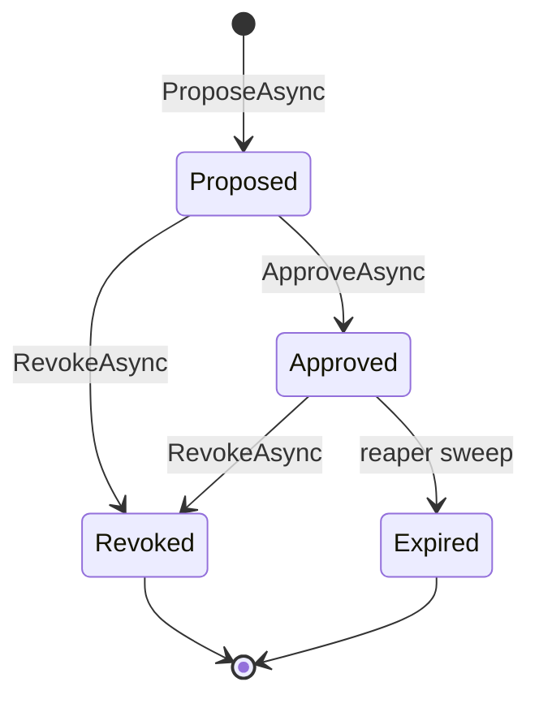

# ADR 0005 — Overrides

## Status

**Accepted** — 2026-04-21. Closes Epic P5 (rivoli-ai/andy-policies#5).
The implementation stories (P5.1 #49, P5.2 #52, P5.3 #53, P5.4 #56,
P5.5 #58, P5.6 #59, P5.7 #60, P5.8 #62) shipped ahead of this ADR's
acceptance because the aggregate shape, state machine, and reaper
semantics were already pinned in the per-story specs. This ADR
captures the decisions authoritatively for downstream readers
(Conductor admission, Cockpit, andy-mcp-gateway).

Supersedes: nothing. Companion to:

- [ADR 0001 — Policy versioning](0001-policy-versioning.md) (defines
  the `PolicyVersion` aggregate that overrides reference).
- [ADR 0002 — Lifecycle states](0002-lifecycle-states.md) (the
  `Retired` state propose-time validation refuses).
- [ADR 0003 — Bindings](0003-bindings.md) (overrides relax bindings
  for a principal/cohort; bindings still target a `PolicyVersion`).
- [ADR 0004 — Scope hierarchy + tighten-only resolution](0004-scope-hierarchy.md)
  (P4.3 chain resolution calls `IOverrideService.GetActiveAsync` to
  apply overrides to the effective set).
- [ADR 0006 — Audit hash chain](0006-audit-hash-chain.md) (every
  propose / approve / revoke / expiry emits a domain event the
  audit chain consumes).
- [ADR 0007 — Edit RBAC](0007-edit-rbac.md) (per-action permission
  gates that wrap `ApproveAsync` and `RevokeAsync`).

## Context

Epic P5 introduces overrides — a time-bounded, approver-gated
relaxation of a policy binding for a specific principal or cohort.
Without overrides, the only way to relax a stricter-tightens-only
binding (P4) is to mutate the binding itself, which is forbidden by
the tighten-only invariant. With overrides, the catalog stays
tighten-only at the binding layer and exceptions are recorded as
explicit, time-bounded, audit-traceable rows.

The model has to balance four concerns:

1. **Auditability.** Every grant of an exception must record actor,
   approver, rationale, scope, expiry, and (if Replace) the
   replacement version. The audit chain (P6) is the source of
   truth — overrides are content-only data; nothing about identity
   or notification flows through this service.
2. **Surface parity.** REST, MCP, gRPC, and CLI must behave
   identically. The state machine and self-approval invariant
   live in `OverrideService`; surfaces are thin wire-format
   adapters.
3. **Operational reversibility.** A misissued override must be
   revocable in one call. A feature-wide rollback must be possible
   without code changes (the andy-settings gate).
4. **Embedded mode parity.** SQLite-backed deployments (P10) must
   support the same workflow with the same semantics — no
   Postgres-only features (no `pg_cron`, no triggers).

Three drift risks this ADR addresses, flagged during P5
implementation:

- **Self-approval.** Without an explicit invariant, an approver
  who happens to also have the propose permission could
  rubber-stamp their own request. RBAC alone isn't sufficient
  (a misconfigured grant would be a foot-gun).
- **The reaper as the only path to `Expired`.** Approved overrides
  past their `ExpiresAt` must transition automatically; doing this
  on read would race with `GetActiveAsync` consumers and break
  audit (no event would fire). The reaper centralizes the
  transition.
- **Settings-gate ergonomics.** Operators need a one-flag rollback
  for "the experiment is going badly." That flag must be
  fail-closed (default off, unreachable settings → off) so a
  partial andy-settings outage doesn't accidentally enable a
  feature that's still being rolled out.

## Decisions

### 1. Four-state machine: `Proposed → Approved → (Revoked | Expired)`



`OverrideState` is a closed enum; transitions are enforced inside
serializable EF transactions. There is no `Rejected` state — an
approver rejecting a `Proposed` row revokes it with a
`revocationReason` like `rejected_by_approver:{id}`. This keeps the
state machine narrow (4 states, 4 transitions) and the audit log's
terminology consistent (every terminal transition reads as
"revoked" or "expired", never "rejected").

### 2. Reaper hosted service over DB triggers

A `BackgroundService` (P5.3) sweeps the `overrides` table every
60 seconds (configurable via
`andy.policies.overrideExpiryReaperCadenceSeconds`, clamped
≥5s) and transitions `Approved` rows past `ExpiresAt` to
`Expired`. The reaper runs even when the experimental-overrides
gate is off — turning the feature off must not strand existing
approved overrides past expiry.

**Rejected alternative — DB triggers / pg_cron.** SQLite has no
equivalent (P10 embedded mode would lose the feature). pg_cron
is also a Postgres extension that ops would need to install on
production clusters. A hosted service is a single in-process
cost that works the same on both providers.

**Rejected alternative — Lazy expiry on read.** Computing
"expired-or-not" on every `GetActiveAsync` call is fine for the
visible-set semantics (P5.5 already filters on `ExpiresAt > now`
client-side), but the audit chain needs an `OverrideExpired`
event with an actor (`system:reaper`) and a timestamp. A read-time
filter doesn't emit events. The reaper is the only path that
both flips the row and produces an audit-visible transition.

### 3. Self-approval is a domain invariant, not an RBAC rule

`ApproveAsync` rejects `approver == proposer` with
`SelfApprovalException` *before* the RBAC delegation. An approver
who happens to also have the `andy-policies:override:approve`
permission still cannot rubber-stamp their own proposal.

This is defense in depth against a misconfigured RBAC grant. RBAC
authorization checks "may this subject perform this action?"; the
two-person rule answers "may this subject perform this action *on
this row*?" — a question with a row-aware constraint that doesn't
fit cleanly into a permission grant. Putting the invariant in
the domain layer also means it travels with the service: every
surface (REST, MCP, gRPC, CLI) inherits it without the surface
having to know about it.

**Rejected alternative — model the rule as an RBAC scope.**
Possible in principle (`override:approve:not-self`); rejected
because the rule is universal. A consumer can't *opt out* of
two-person review — a per-deployment toggle would be a sharp
edge that someone would eventually flip "for development".

### 4. Fail-closed settings gate

`andy.policies.experimentalOverridesEnabled` (Boolean, default
`false`) gates **writes only**. When the snapshot has not yet
observed the key (cold start, andy-settings briefly unreachable),
`IExperimentalOverridesGate.IsEnabled` returns `false`. Reads bypass
the gate so the resolution algorithm (P4.3) and Conductor admission
keep working when the toggle is off.

The fail-closed posture is deliberately the safer state: turning
a feature off can't break correctness. If we defaulted to on,
a partial andy-settings outage would hand consumers an
unreviewed-by-this-ADR feature.

**Rejected alternative — environment variable**
(`ANDY_POLICIES_EXPERIMENTAL_OVERRIDES`). Works for dev, but
bypasses andy-settings's scope hierarchy (Application / Machine /
Team scopes). For a feature whose blast radius is a multi-tenant
catalog, ops needs the per-team granularity to roll out
incrementally.

**Rejected alternative — gate at the service layer (inside
`ProposeAsync`).** Would force the reaper to bypass the gate,
complicating the contract. Gating at the surface layer keeps the
service gate-agnostic — the reaper, MCP, REST, and gRPC each
apply the gate where it makes sense for their layer.

### 5. `Effect = Exempt | Replace` over a general expression language

Two effects covers every concrete use case we identified during
P5 design:

- `Exempt` — the principal/cohort is exempted from the policy.
- `Replace` — the principal/cohort is governed by a different
  `PolicyVersion`.

A general expression language (e.g. "for principal `user:42`,
relax `Mandatory` to `Recommended`") was considered and rejected
on three grounds: audit grep-ability ("show me every override
that exempted user:42 from policy X" is one column-equality
query, not a parse-the-expression scan), simplicity of the
state machine (each effect maps to exactly one resolver branch),
and future extension (additional effects can be added in a later
ADR without breaking the binary state-machine shape). The DB
CHECK constraint `ck_overrides_effect_replacement` keeps
`(Effect=Replace ↔ ReplacementPolicyVersionId IS NOT NULL)`
true at the row level.

### 6. Storage shape

```sql
CREATE TABLE overrides (
    "Id"                          uuid PRIMARY KEY,
    "PolicyVersionId"             uuid NOT NULL REFERENCES policy_versions("Id") ON DELETE RESTRICT,
    "ScopeKind"                   text NOT NULL,           -- HasConversion<string>; "Principal" | "Cohort"
    "ScopeRef"                    varchar(256) NOT NULL,
    "Effect"                      text NOT NULL,           -- "Exempt" | "Replace"
    "ReplacementPolicyVersionId"  uuid REFERENCES policy_versions("Id") ON DELETE RESTRICT,
    "ProposerSubjectId"           varchar(128) NOT NULL,
    "ApproverSubjectId"           varchar(128),
    "State"                       text NOT NULL,           -- "Proposed" | "Approved" | "Revoked" | "Expired"
    "ProposedAt"                  timestamptz NOT NULL,
    "ApprovedAt"                  timestamptz,
    "ExpiresAt"                   timestamptz NOT NULL,
    "Rationale"                   varchar(2000) NOT NULL,
    "RevocationReason"            varchar(2000),
    "Revision"                    bigint NOT NULL,         -- optimistic concurrency token
    CONSTRAINT ck_overrides_effect_replacement CHECK (
        ("Effect" = 'Exempt'  AND "ReplacementPolicyVersionId" IS NULL) OR
        ("Effect" = 'Replace' AND "ReplacementPolicyVersionId" IS NOT NULL)
    )
);

CREATE INDEX ix_overrides_scope_state
    ON overrides ("ScopeKind", "ScopeRef", "State");
CREATE INDEX ix_overrides_expiry_approved
    ON overrides ("ExpiresAt") WHERE "State" = 'Approved';
```

`State`, `ScopeKind`, and `Effect` are stored as strings via EF
`HasConversion<string>()` — load-bearing for the partial index
predicate (`WHERE "State" = 'Approved'`) which the reaper relies
on to scan only the rows that could possibly need expiring.

## Consequences

### Positive

- **Explicit, time-bounded grants.** Every exception is a row
  with an actor, an approver, a rationale, and an end date. The
  Cockpit override list is the catalog of every active exception
  in the system.
- **Surface parity by construction.** REST / MCP / gRPC / CLI all
  delegate to one `IOverrideService`. A regression in any one
  surface becomes a service-layer test failure, not a four-times-
  duplicated bug.
- **Embedded mode parity.** No Postgres-only features. SQLite-
  backed deployments (P10) carry the same workflow.
- **Operator reversibility.** Two ways out: revoke an individual
  override, or flip the gate off (writes-only — existing approved
  overrides keep applying until they expire or are revoked).
- **Audit-grade trail.** Every transition emits a domain event;
  P6's hash chain captures the full history with tamper-evident
  ordering.

### Neutral

- **Two-state-machine surface.** The state machine has four
  states; the reaper introduces a fifth implicit state ("approved
  but expired and not yet swept"). `GetActiveAsync` papers over
  the gap by filtering `ExpiresAt > now` client-side. This is
  fine but it's worth knowing.

### Negative

- **Two-person friction in small teams.** A team of one cannot
  override their own work. The mitigation is the admin role —
  ops or security can be the second subject. Some teams will
  initially find this annoying; the ADR's position is that the
  invariant is correct and the friction is the feature.
- **Reaper latency ≤ cadence.** The default 60-second sweep
  cadence means an override may apply for up to 60 seconds past
  its `ExpiresAt`. `GetActiveAsync` masks this for live reads
  (it filters on `ExpiresAt > now` client-side regardless of
  the row's `State`), but the row remains `Approved` until the
  reaper ticks. Audit-driven consumers should treat the row's
  `State` as authoritative only after the next reaper sweep.
- **Cohort membership is opaque.** `ScopeRef` is a consumer-
  defined string. We cannot enumerate "every principal in
  `cohort:beta-redteam`" — that's a consumer responsibility.
  Convention: consumers prefix `ScopeRef` with the kind of cohort
  (`team:`, `workspace:`, etc.) so a future tooling pass can
  bucket without interpreting.

## Considered alternatives

### Binding mutation at each level

Initially proposed: instead of an override layer, allow a Team
admin to flip a `Mandatory` ancestor binding to `Recommended` at
the Team scope. Rejected — violates the stricter-tightens-only
rule from ADR 0004 and provides no audit trail of the relaxation
beyond the binding's update timestamp.

### Ephemeral per-run overrides

An override scoped to a single `Run` (the leaf of the scope
hierarchy). Rejected — P5's epic body explicitly defines override
scope as `Principal | Cohort`. Run-scoped exceptions are a
consumer concern (Conductor's per-run admission overrides), not a
catalog concern.

### External approval workflow

Outsource the propose/approve loop to a Slack bot, ServiceNow,
etc. Rejected — re-introduces the duplication risk that
`CLAUDE.md`'s "REST and MCP share one service layer" rule
exists to prevent. We *do* expect external systems to *trigger*
proposes (a Slack bot calls our REST), but the workflow itself
lives here.

### Detached cryptographic signatures (JWS over an approval bundle)

Non-repudiation by signing the approval. Rejected — P5 epic
explicitly lists non-repudiation as an out-of-scope concern.
The audit hash chain (ADR 0006) provides integrity; signing on
top is a future ADR.

### Single mega-tool / RPC instead of six per surface

Pack `propose | approve | revoke | list | get | active` into one
endpoint with a discriminator. Rejected — fine-grained tools are
the MCP gateway's preference (each tool is independently
discoverable and tagged). Same posture for gRPC and REST.

## References

- Epic [rivoli-ai/andy-policies#5](https://github.com/rivoli-ai/andy-policies/issues/5)
- Stories: P5.1 [#49](https://github.com/rivoli-ai/andy-policies/issues/49),
  P5.2 [#52](https://github.com/rivoli-ai/andy-policies/issues/52),
  P5.3 [#53](https://github.com/rivoli-ai/andy-policies/issues/53),
  P5.4 [#56](https://github.com/rivoli-ai/andy-policies/issues/56),
  P5.5 [#58](https://github.com/rivoli-ai/andy-policies/issues/58),
  P5.6 [#59](https://github.com/rivoli-ai/andy-policies/issues/59),
  P5.7 [#60](https://github.com/rivoli-ai/andy-policies/issues/60),
  P5.8 [#62](https://github.com/rivoli-ai/andy-policies/issues/62),
  P5.9 [#63](https://github.com/rivoli-ai/andy-policies/issues/63).
- Concept doc: [Overrides](../concepts/overrides.md).
- Approver runbook: [Override approver](../runbooks/override-approver.md).
- Operator runbook: [Override operator](../runbooks/override-operator.md).
