# Overrides

An **override** is a time-bounded, approver-gated relaxation of a
policy binding for a specific principal or cohort. Targeted at a
contributor about to touch `OverrideService`, the reaper, or any of
the four override surfaces (REST, MCP, gRPC, CLI) — and at consumer
engineers wiring overrides into Conductor admission. For the *why*
behind each design decision, see [ADR 0005 — Overrides](../adr/0005-overrides.md).

> **Scope reminder.** Overrides are content-only catalog rows. They
> do not manage identity (who is in which cohort), notification
> (who gets pinged on approval), or enforcement (the consumer
> applies the relaxed binding at admission time). All three live
> in other services.

## State machine

```mermaid
stateDiagram-v2
    [*] --> Proposed: ProposeAsync
    Proposed --> Approved: ApproveAsync (approver != proposer; RBAC granted)
    Proposed --> Revoked: RevokeAsync (proposer or admin)
    Approved --> Revoked: RevokeAsync (admin or revoke permission)
    Approved --> Expired: reaper sweep (ExpiresAt <= now)
    Revoked --> [*]
    Expired --> [*]
```



Four states, three terminal forms (`Revoked`, `Expired`, plus implicit
end-of-life on `Approved` rows whose `ExpiresAt` has passed but the
reaper has not yet swept).

| State | Entered by | Visible to readers | Visible to `GetActiveAsync` |
|---|---|---|---|
| `Proposed` | `ProposeAsync` | yes | no |
| `Approved` | `ApproveAsync` | yes | yes — until `ExpiresAt` |
| `Revoked` | `RevokeAsync` from `Proposed` or `Approved` | yes (audit) | no |
| `Expired` | reaper sweep — only path | yes (audit) | no |

There is no `Rejected` state. Approver rejection is modeled as
`RevokeAsync` from `Proposed` with a revocation reason like
`rejected_by_approver:{approverId}`. This keeps the state machine
narrow and the audit trail's terminology consistent.

## Effect: `Exempt` vs `Replace`

Every override carries an `Effect` describing what the override does
to the targeted policy:

| Effect | Meaning | `ReplacementPolicyVersionId` |
|---|---|---|
| `Exempt` | The principal/cohort is exempted from the policy entirely. | must be null |
| `Replace` | The principal/cohort is governed by a different `PolicyVersion` instead. | must point to an Active or WindingDown version |

Both shapes carry the same approver, expiry, and rationale. The DB
CHECK constraint `ck_overrides_effect_replacement` enforces the
nullability invariant; the service layer enforces it again before
the row is written so callers see a structured `400 invalid_argument`
rather than a `DbUpdateException`.

### Worked example — `Exempt`

A vendor-blocked story sits behind the `must-pin-vendor-license`
policy, which requires every PR to have a vendor-license stamp.
Engineering proposes an override exempting `user:42` from that
policy for 24 hours so they can land a docs-only fix while the
vendor's licensing portal is down.

```http
POST /api/overrides
{
  "policyVersionId": "9f3c…", // the must-pin-vendor-license version
  "scopeKind": "Principal",
  "scopeRef": "user:42",
  "effect": "Exempt",
  "replacementPolicyVersionId": null,
  "expiresAt": "2026-05-02T18:00:00Z",
  "rationale": "vendor licensing portal down — see incident #INC-1142"
}
```

The on-call EM (a different subject than `user:42`) approves;
within seconds Conductor admission lets the docs-only PR through
because `GetActiveAsync(Principal, user:42)` now returns the override
row. 24 hours later the reaper transitions the override to `Expired`;
the next admission for `user:42` sees an empty override set and the
mainline policy applies again.

### Worked example — `Replace`

A red-team exercise needs a beta-tester cohort to run under a
relaxed `branch-protection` policy. Security proposes an override
replacing the production `branch-protection-v3` version with the
relaxed `branch-protection-redteam-v1` for the cohort
`cohort:beta-redteam`, expiring at the end of the exercise window.

```http
POST /api/overrides
{
  "policyVersionId": "5a1e…", // branch-protection-v3
  "scopeKind": "Cohort",
  "scopeRef": "cohort:beta-redteam",
  "effect": "Replace",
  "replacementPolicyVersionId": "8b29…", // branch-protection-redteam-v1
  "expiresAt": "2026-05-15T00:00:00Z",
  "rationale": "RT-2026-Q2 exercise — see ticket #SEC-9431"
}
```

A second security engineer approves. For the next two weeks,
admission for any principal in `cohort:beta-redteam` resolves to
the redteam version of `branch-protection`; everyone else still
gets the production version. After expiry the redteam pull-rights
revert without operator action.

## How resolution consults overrides

P4.3's stricter-tightens-only fold is the canonical resolution
path. Overrides plug in via a single read:

```
IOverrideService.GetActiveAsync(scopeKind, scopeRef, ct)
  → only Approved + non-expired rows matching the (kind, ref) pair
```

Implications:

- The resolver never sees `Proposed` rows — they're invisible until
  approved.
- The resolver never sees `Revoked` or `Expired` rows — they're
  invisible immediately on transition (the reaper does not need to
  tick before the resolver stops returning a row, because
  `GetActiveAsync` filters on the live `ExpiresAt > now` predicate
  too).
- Override storage is a flat table; the hierarchy walk is the
  scope chain. Overrides are not themselves hierarchical — there
  is no "parent override" or scope-walk for the override layer.

## Firewalls (epic recap)

| Concern | Where it lives |
|---|---|
| Identity (who is `user:42`?) | andy-auth |
| Cohort membership (who is in `cohort:beta-redteam`?) | consumer-defined; we do not expand it |
| Approval workflow / notifications | external (Slack, email, ticketing) |
| Audit trail of override mutations | P6 — every propose / approve / revoke / expiry emits a domain event |
| RBAC for `override:approve`, `override:revoke` | andy-rbac (P7) |
| Settings gate (`andy.policies.experimentalOverridesEnabled`) | andy-settings |

## When to use an override

The bar is **explicit, time-bounded, narrow scope**. If you find
yourself proposing the same override pattern repeatedly, the right
move is usually a scoped *binding* (P3) at a deeper node in the
scope hierarchy (P4), not an override.

Heuristic:

- **One principal, one short window** — override.
- **A handful of principals, recurring weekly** — override is fine
  but consider whether there's a real cohort that should become a
  first-class scope.
- **More than 5 principals or longer than 90 days** — stop. A scoped
  binding is probably what you want; consult the Cockpit team and
  the policy owner before proceeding.
- **Permanent or unbounded** — never. The propose-time `+1 minute`
  floor is a guardrail; the *spirit* of the rule is "every override
  has an end date you know in advance."

## Surfaces

All four surfaces delegate to `IOverrideService`. Behaviour is
identical across surfaces; only the wire format differs.

| Surface | Endpoint |
|---|---|
| REST | `POST /api/overrides`, `POST /api/overrides/{id}/approve\|revoke`, `GET /api/overrides[/{id}\|/active]` |
| MCP | `policy.override.{propose,approve,revoke,list,get,active}` |
| gRPC | `OverridesService.{ProposeOverride,ApproveOverride,RevokeOverride,ListOverrides,GetOverride,GetActiveOverrides}` |
| CLI | `andy-policies-cli overrides {propose,approve,revoke,list,get,active}` |

The error-code contract is also identical: every surface returns
the same stable strings (`override.disabled`,
`override.self_approval_forbidden`, `rbac.denied`, etc.) so
consumers can branch on them without parsing English. The OpenAPI
document publishes the codes as `x-error-codes` extensions.

## Related design

- [ADR 0005 — Overrides](../adr/0005-overrides.md) — design rationale
  for every decision pinned in this doc.
- [Resolution algorithm](../design/resolution-algorithm.md) — how
  P4.3 calls `GetActiveAsync` during the stricter-tightens-only
  fold.
- [Approver runbook](../runbooks/override-approver.md) — for humans
  holding the `approver` role.
- [Operator runbook](../runbooks/override-operator.md) — settings
  gate, reaper, emergency disable.
