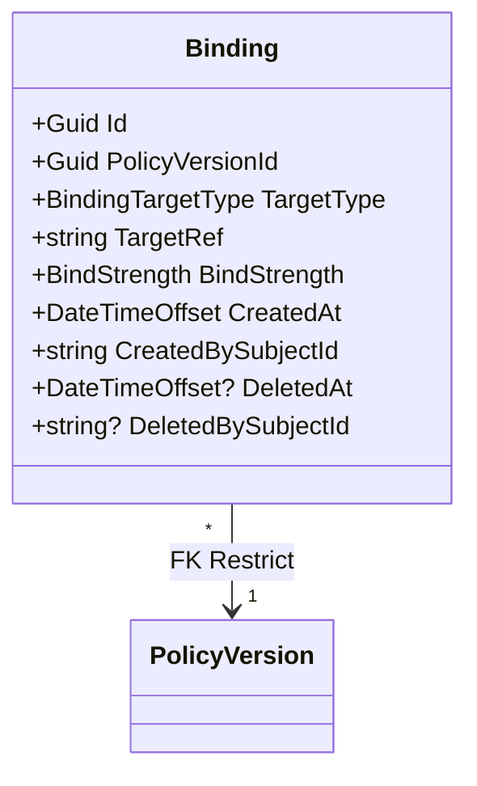

# Bindings

How andy-policies links a `PolicyVersion` to a foreign target — what the
binding row stores, how each capability surface (REST, MCP, gRPC, CLI)
exposes the model, and which guarantees the catalog makes around
retired-version refusal, soft-delete, and same-target deduplication on
resolve.

This document targets two readers: a contributor about to touch
`BindingService`, and a consumer engineer (Conductor's ActionBus,
andy-tasks per-task gates) who's wiring up policy resolution. For the
*why* — the metadata-only firewall, soft-delete preservation, dedup
rules — see [ADR 0003 — Bindings](../adr/0003-bindings.md). For the
underlying aggregate, see [Policy Document Core](policy-document-core.md);
for lifecycle states, [Lifecycle States](lifecycle.md).

> **Scope reminder.** Bindings are **metadata only**. `targetRef` is an
> opaque foreign-system reference handed to us by a consumer; andy-policies
> never resolves it against the foreign system. Cross-service consistency
> of the target is the consumer's contract — see Epic P3 Non-goals.

## Aggregate

`Binding` has its own identity (`Id`) and an FK to the immutable
`PolicyVersion` it attaches to. The FK is `OnDelete(DeleteBehavior.Restrict)`:
deleting a version with active bindings is rejected at the DB layer.
Bindings are never hard-deleted — `DeletedAt` is the tombstone.

## Canonical TargetRef shapes

`TargetRef` is opaque per Epic P3, but each `TargetType` has a canonical
shape that consumers must use so cross-service resolution stays
deterministic:

| `TargetType` | Canonical `TargetRef`                | Resolved by                                   |
|--------------|--------------------------------------|-----------------------------------------------|
| `Template`   | `template:{guid}`                    | andy-tasks template id                        |
| `Repo`       | `repo:{org}/{name}`                  | GitHub-style slug                             |
| `ScopeNode`  | `scope:{guid}`                       | `ScopeNode.Id` (P4.2 resolves path → id)      |
| `Tenant`     | `tenant:{guid}`                      | Tenant id                                     |
| `Org`        | `org:{guid}`                         | Org id                                        |

`BindingService.CreateAsync` (P3.2) validates non-empty + ≤512-char
`TargetRef` but does **not** enforce these shapes — Epic P3 punts to
consumers, who can validate as strictly as they want. The shapes are
load-bearing for P4's hierarchy walk and P8's bundle resolve, which join
on the canonical key.

## Indexes

Three indexes back the read paths:

| Index                              | Columns                          | Used by                          |
|------------------------------------|----------------------------------|----------------------------------|
| `ix_bindings_target`               | `(TargetType, TargetRef)`        | `ListByTargetAsync`, `ResolveExactAsync`, P4 hierarchy walk |
| `ix_bindings_policy_version`       | `(PolicyVersionId)`              | `ListByPolicyVersionAsync`, P3.2 retire-cascade refusal     |
| `ix_bindings_deleted_at`           | `(DeletedAt)`                    | active-only filtering            |

The composite `ix_bindings_target` is the hot path for consumers: every
target-side lookup (`/api/bindings`, `/api/bindings/resolve`, P4 walk-up)
hits this index.

## Mutation rules

### Create

`POST /api/bindings` and equivalents:

1. Validate `targetRef` non-empty (after trim) and ≤512 chars.
2. Load the target `PolicyVersion`.
3. **Refuse if `State == Retired`.** `Active` and `WindingDown` both
   accept new bindings — the `WindingDown` allowance lets consumers
   author bindings during a sunset window.
4. Insert the row; emit `binding.created` to `IAuditWriter` (the real
   hash-chained implementation lands in P6).

The retired-version guard is the only state-machine coupling between
`BindingService` and `LifecycleTransitionService`; a binding never
points at a non-existent version because of the FK Restrict.

### Delete

`DELETE /api/bindings/{id}?rationale=...` and equivalents:

1. Load the binding; treat `DeletedAt IS NOT NULL` as not-found.
2. Stamp `DeletedAt = now`, `DeletedBySubjectId = actor`.
3. Emit `binding.deleted` to `IAuditWriter` with the optional rationale.

Tombstoned bindings remain navigable by `GET /api/bindings/{id}` so
audit investigators can inspect `DeletedAt`. They are excluded from
`/api/bindings?targetType=…&targetRef=…` (`ListByTargetAsync`) and from
`/api/bindings/resolve` by default. The version-rooted listing
(`/api/policies/{id}/versions/{vid}/bindings?includeDeleted=true`)
opts in.

## Resolve semantics (P3.4)

`GET /api/bindings/resolve` is the consumer-facing read. It joins each
live binding to its `Policy` and `PolicyVersion` and returns a
deduplicated, ordered list of `ResolvedBindingDto`s:

1. **Filter Retired.** Bindings whose target version is `Retired` are
   never surfaced in resolve, even if the row is still alive (e.g. the
   version transitioned to `Retired` after the binding was created).
2. **Dedup by `PolicyVersionId`.** When a single target has multiple
   bindings to the same version (administrative duplicate), the
   `Mandatory` bind wins over `Recommended`; ties go to the earliest
   `CreatedAt`. The dedup is in-memory after the JOIN.
3. **Order deterministically.** Policy name ASC, then version number
   DESC. Callers that snapshot the response can rely on the byte order.

**Exact-match only — no hierarchy walk.** That lands in P4 behind a
`?mode=hierarchy` flag on the same endpoint, so consumers don't have to
move when it ships.

## Surface parity

| Surface | Operation                                                                    | Story |
|---------|------------------------------------------------------------------------------|-------|
| REST    | `POST /api/bindings`, `DELETE /api/bindings/{id}`, `GET /api/bindings/{id}`, `GET /api/bindings?targetType=&targetRef=`, `GET /api/bindings/resolve`, `GET /api/policies/{id}/versions/{vid}/bindings` | [P3.3](https://github.com/rivoli-ai/andy-policies/issues/21), [P3.4](https://github.com/rivoli-ai/andy-policies/issues/22) |
| MCP     | `policy.binding.list`, `policy.binding.create`, `policy.binding.delete`, `policy.binding.resolve` | [P3.5](https://github.com/rivoli-ai/andy-policies/issues/23) |
| gRPC    | `andy_policies.BindingService` — `CreateBinding`, `DeleteBinding`, `GetBinding`, `ListBindingsByPolicyVersion`, `ListBindingsByTarget`, `ResolveBindings` | [P3.6](https://github.com/rivoli-ai/andy-policies/issues/24) |
| CLI     | `andy-policies-cli bindings {list,create,delete,resolve}`                    | [P3.7](https://github.com/rivoli-ai/andy-policies/issues/25) |

All four surfaces delegate to the same `IBindingService` /
`IBindingResolver` — there is no business logic anywhere outside
`BindingService` and `BindingResolver`. The
`BindingCrossSurfaceParityTests` integration suite (P3.8) drives the
same logical request through REST, MCP, and gRPC and asserts the
response set is identical (count, binding ids, dimension fields).

## Error mapping

| Service exception                       | REST    | gRPC                  | MCP error code                      |
|-----------------------------------------|---------|-----------------------|-------------------------------------|
| `NotFoundException`                     | 404     | `NotFound`            | `policy.binding.not_found`          |
| `BindingRetiredVersionException`        | 409     | `FailedPrecondition`  | `policy.binding.retired_target`     |
| `ConflictException`                     | 409     | `AlreadyExists`       | (none — no other 409 path today)    |
| `ValidationException`                   | 400     | `InvalidArgument`     | `policy.binding.invalid_target`     |

CLI exit codes follow the federated-CLI contract from Conductor
Epic AN: 0 success, 2 bad arguments, 3 auth, 4 not found, 5 conflict
(covers `BindingRetiredVersionException`).

## Concurrency model

Creates and soft-deletes are independent — there's no cross-row
invariant beyond the FK to `PolicyVersion`, so a thundering herd of
parallel mutations does not deadlock. The
`BindingConcurrencyStressTests` integration suite (P3.8) demonstrates
N=50 parallel creates against the same target all commit, and a mixed
50-thread create+delete workload converges to a consistent end state
(every row either alive with no `DeletedAt` or tombstoned with a
matching `DeletedBySubjectId`).

The retired-version guard runs inside the create's serializable
transaction, so a concurrent retire can race a concurrent create — one
of two outcomes:

- The retire commits first → the create observes `State == Retired` and
  throws `BindingRetiredVersionException`.
- The create commits first → the binding row is alive against the
  newly-Retired version. Subsequent resolves filter it out (see "Filter
  Retired" above), so consumers see the same end state either way.

## Cross-references

- [ADR 0001 — Policy versioning](../adr/0001-policy-versioning.md) —
  the aggregate shape and immutability rules these bindings sit on.
- [ADR 0002 — Lifecycle states](../adr/0002-lifecycle-states.md) — the
  retired-version refusal cited above.
- [Lifecycle States design](lifecycle.md) — surface parity table for
  the lifecycle state machine these bindings observe.
- [ADR 0003 — Bindings are content-only metadata](../adr/0003-bindings.md) — the decisions captured authoritatively (metadata-only firewall, soft-delete preservation, dedup rules, surface parity).
- [Consumer integration: bindings](../guides/consumer-integration-bindings.md) — step-by-step guide for services that consume the binding surface.
