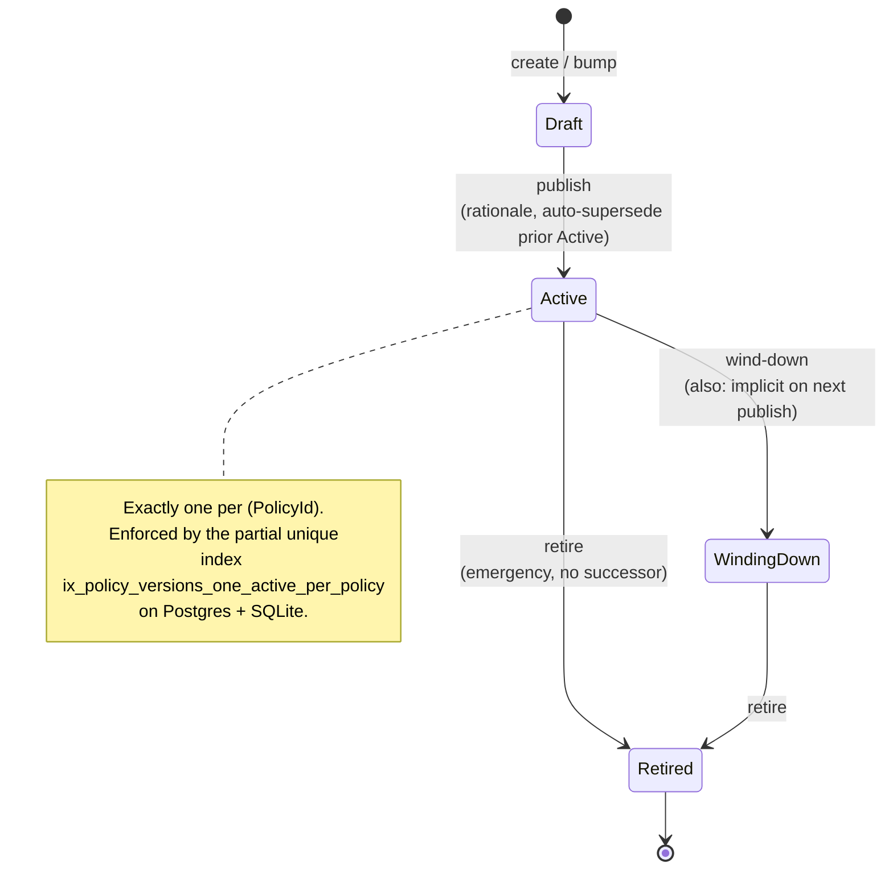

# Lifecycle States

How a `PolicyVersion` moves from authoring to retirement, and which guarantees the catalog makes at every commit boundary.

This document targets two readers: a contributor about to touch
`LifecycleTransitionService`, and a consumer engineer who needs to know what
"this policy is in `WindingDown`" means for their integration. For the
*why* — the four-state shape, auto-supersede atomicity, the only-one-Active
invariant — see [ADR 0002 — Lifecycle states](../adr/0002-lifecycle-states.md).
For the aggregate shape, see [ADR 0001 — Policy versioning](../adr/0001-policy-versioning.md)
and [Policy Document Core](policy-document-core.md).

> **Scope reminder.** This service stores *what* state a version is in and
> records who/when/why every transition happened. It does not block actions
> based on lifecycle state — that's a consumer concern (Conductor's
> ActionBus, andy-tasks per-task gates). Every behavior described below is
> about catalog content, not enforcement.

## State diagram



## Transition matrix

| From ↓ / To → | Draft | Active            | WindingDown          | Retired              |
|---------------|:-----:|:-----------------:|:--------------------:|:--------------------:|
| **Draft**     | —     | ✓ `Publish`       | ✗                    | ✗                    |
| **Active**    | ✗     | —                 | ✓ `WindDown`         | ✓ `Retire`           |
| **WindingDown** | ✗   | ✗                 | —                    | ✓ `Retire`           |
| **Retired**   | ✗     | ✗                 | ✗                    | —                    |

Self-transitions are deliberately absent. The matrix is exposed verbatim by
`policy.lifecycle.matrix` (MCP) and `LifecycleService.GetMatrix` (gRPC) so
agents and clients can introspect rather than guess. Rejected combinations
return:

- HTTP `409 Conflict` (REST), or
- `FailedPrecondition` (gRPC), or
- `INVALID_TRANSITION:` prefix (MCP).

## What each state means to consumers

| State | Mutable? | Bindable (P3)? | Resolvable (P4)? | Bundle inclusion (P8)? |
|-------|:--------:|:--------------:|:----------------:|:----------------------:|
| **Draft**       | yes (ADR 0001 §3) | no  | no  | no  |
| **Active**      | no       | yes            | yes (default)    | yes |
| **WindingDown** | no       | **no — refused** | yes (legacy reads continue) | no (post-transition snapshots exclude it) |
| **Retired**     | no       | no             | `410 Gone` unless `?include-retired=true` | no |

Two semantic guarantees consumers can rely on:

1. **A pinned `policyVersionId` keeps resolving** even after the version
   transitions to `WindingDown`. Conductor's `DelegationContract` pins
   versions; bumping the active version must not break those pins.
2. **A `Retired` version is never silently re-promoted.** Once a version
   stamps `RetiredAt`, no transition out of `Retired` exists in the matrix.

## Auto-supersede on publish

Publishing version *vN* atomically transitions the prior `Active` version
(if any) to `WindingDown`, in the same DB transaction:

```
Begin SERIALIZABLE
  prior = SELECT … WHERE PolicyId = @id AND State = 'Active'
  IF prior IS NOT NULL:
    prior.State = WindingDown
    prior.SupersededByVersionId = @newVersionId
    SaveChanges          ← issued before the new-version write so the
                           partial unique index sees the prior row leave
                           the Active set first
  target.State = Active
  target.PublishedAt = now
  target.PublishedBySubjectId = actor
  SaveChanges
Commit
Dispatch PolicyVersionSuperseded (if applicable), PolicyVersionPublished
```

The split-`SaveChanges` ordering matters: EF Core would otherwise batch the
`UPDATE` statements in tracker order, putting the new-version write first
on at least some loaders, which trips
`ix_policy_versions_one_active_per_policy` because two rows briefly satisfy
`State = 'Active'`. The two writes still commit atomically — they live
inside one open serializable transaction — but each `UPDATE` is now
visible to the index check in a deterministic order. (See the commit that
landed P2.3 for the regression that surfaced this.)

## Concurrency model — only-one-Active

The headline invariant is **at most one `PolicyVersion` per `Policy` is in
state `Active` at any commit boundary.** Two layers enforce it:

1. **Postgres / SQLite partial unique index** — the authoritative guard:

   ```sql
   CREATE UNIQUE INDEX ix_policy_versions_one_active_per_policy
     ON policy_versions (PolicyId)
     WHERE State = 'Active';
   ```

   A racing publish that would produce two Active rows raises
   `23505` (Postgres `unique_violation`) or SQLite error 19
   (`UNIQUE constraint failed`). `LifecycleTransitionService` catches both
   shapes and translates to `ConcurrentPublishException`.

2. **Serializable transaction wrapping the read-then-write** — on Postgres
   this catches the race even before the index does, surfacing as
   `40001 serialization_failure`. On SQLite, EF maps `Serializable` to
   `BEGIN IMMEDIATE`, which acquires a reserved lock — adequate for the
   single-writer model.

The 50-publish stress test in
`tests/Andy.Policies.Tests.Integration/Services/ConcurrentPublishTests.cs`
demonstrates the invariant: 50 distinct drafts of the same policy publish
in parallel under Postgres serializable isolation; exactly one transition
commits as `Active`, the other 49 surface as `409 Conflict`, and the DB
ends with a single Active row.

## Rationale enforcement

Every transition takes a `rationale` string. Whether it's required is
controlled by the andy-settings toggle
`andy.policies.rationaleRequired` (default `true`):

- Toggle on (default) — empty / whitespace / null `rationale` returns
  `400 Bad Request` with `type=/problems/rationale-required` and
  `errors.rationale` populated.
- Toggle off — every value (including null) is accepted; rationale still
  flows through to the audit chain (P6) but is recorded as null.

`AndySettingsRationalePolicy` reads the setting from `ISettingsSnapshot`
on every check, so a flip in the andy-settings admin UI takes effect on
the next snapshot refresh (default 60s) without restarting the service.
Fail-safe: when the snapshot has not observed the key (cold start,
andy-settings briefly unreachable), `IsRequired` defaults to `true`.

The current value is exported as the OpenTelemetry observable gauge
`andy_policies_rationale_required_toggle_value` (1 = on, 0 = off) on the
`Andy.Policies` meter so operators can verify the toggle reached the live
process.

## Surface parity

All four surfaces drive transitions through the same
`ILifecycleTransitionService.TransitionAsync(policyId, versionId, target,
rationale, actor, ct)`. There is no business logic in any controller, MCP
tool, gRPC service, or CLI command beyond actor-claim resolution and
exception → wire-format mapping.

| Surface | Verb / endpoint                                                                                       | Story |
|---------|-------------------------------------------------------------------------------------------------------|-------|
| REST    | `POST /api/policies/{id}/versions/{vId}/{publish,winding-down,retire}` (`{ rationale }`)              | [P2.3](https://github.com/rivoli-ai/andy-policies/issues/13) |
| MCP     | `policy.version.publish`, `policy.version.transition`, `policy.lifecycle.matrix`                       | [P2.5](https://github.com/rivoli-ai/andy-policies/issues/15) |
| gRPC    | `andy_policies.LifecycleService/{PublishVersion,TransitionVersion,GetMatrix}`                          | [P2.6](https://github.com/rivoli-ai/andy-policies/issues/16) |
| CLI     | `andy-policies-cli versions {publish,wind-down,retire} <policyIdOrName> <versionId> --rationale ...`  | [P2.7](https://github.com/rivoli-ai/andy-policies/issues/17) |

Wire-format casing is uniform per ADR 0001 §6: state values are PascalCase
(`Draft` / `Active` / `WindingDown` / `Retired`) on every surface.

## Domain events

Every transition emits in-process domain events through
`IDomainEventDispatcher` after the transaction commits:

```csharp
public sealed record PolicyVersionPublished(Guid PolicyId, Guid PolicyVersionId, int Version, string ActorSubjectId, string Rationale, DateTimeOffset At);
public sealed record PolicyVersionSuperseded(Guid PolicyId, Guid PolicyVersionId, Guid SupersededByVersionId, DateTimeOffset At);
public sealed record PolicyVersionRetired(Guid PolicyId, Guid PolicyVersionId, string ActorSubjectId, string Rationale, DateTimeOffset At);
```

Order matters when both fire: `PolicyVersionSuperseded` is dispatched
before `PolicyVersionPublished` so subscribers can pair `(old, new)`
atomically. Subscribers (audit chain in P6, projections, etc.) handle
their own errors — the dispatcher swallows handler exceptions so a
broken subscriber never rolls back the transition.

## Telemetry

| Signal                                                  | Type                | Source                                  |
|---------------------------------------------------------|---------------------|-----------------------------------------|
| `andy_policies_rationale_required_toggle_value`         | Observable gauge    | `AndySettingsRationalePolicy`           |
| Per-RPC HTTP / gRPC request metrics                     | OTel auto-collected | ASP.NET Core + Grpc.AspNetCore         |
| `Microsoft.EntityFrameworkCore` instrumentation         | Traces              | `AddEntityFrameworkCoreInstrumentation` |

## Cross-references

- [ADR 0001 — Policy versioning](../adr/0001-policy-versioning.md) —
  the aggregate shape and immutability rules these states sit on.
- [ADR 0002 — Lifecycle states](../adr/0002-lifecycle-states.md) —
  the design decisions captured in this document.
- [ADR 0006 — Audit hash chain](../adr/0006-audit-hash-chain.md) —
  the audit shape every transition writes into.
- [ADR 0007 — Edit RBAC](../adr/0007-edit-rbac.md) — the
  per-transition permission gates that wrap these state changes (P7).
