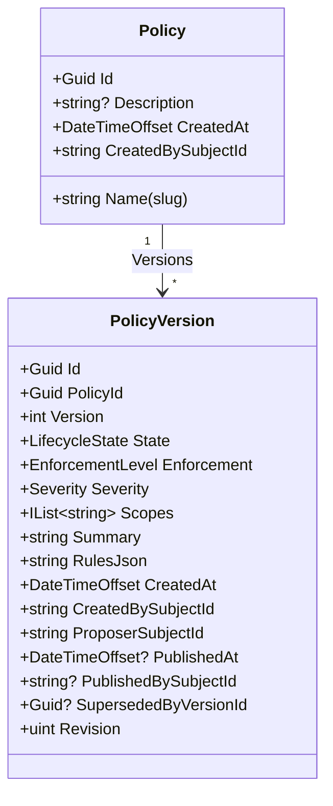
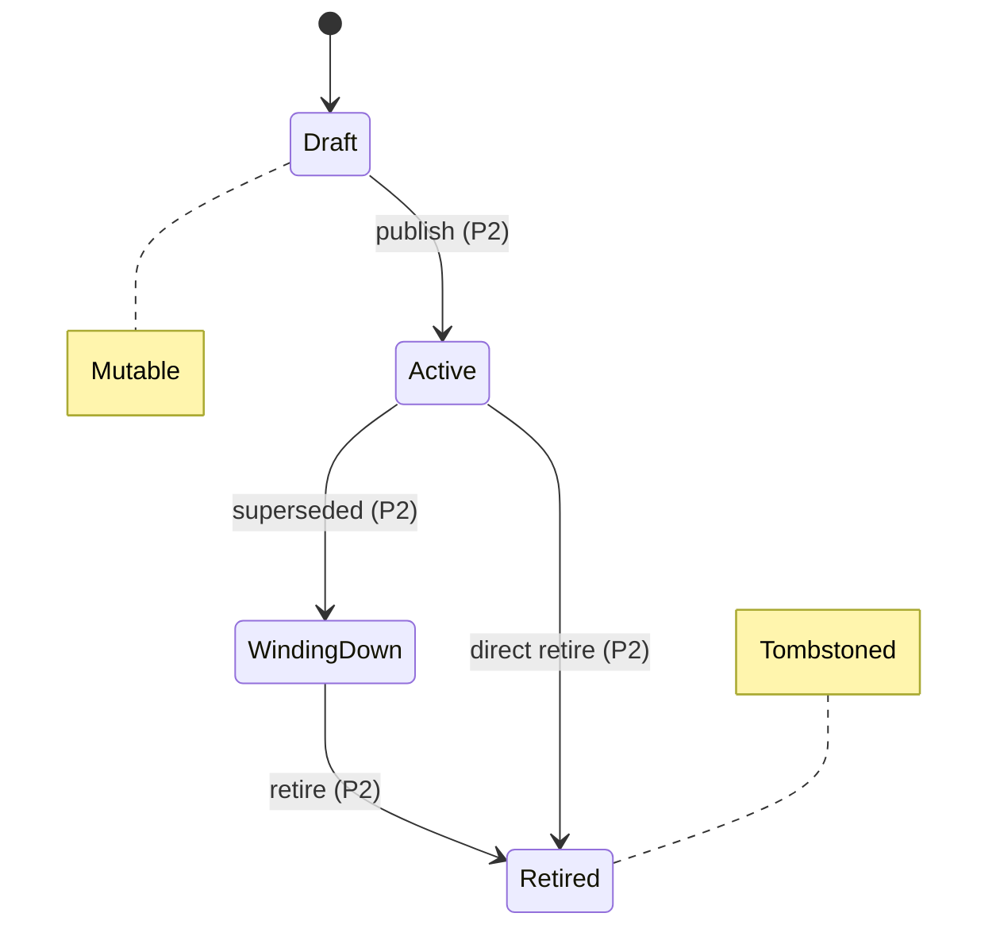
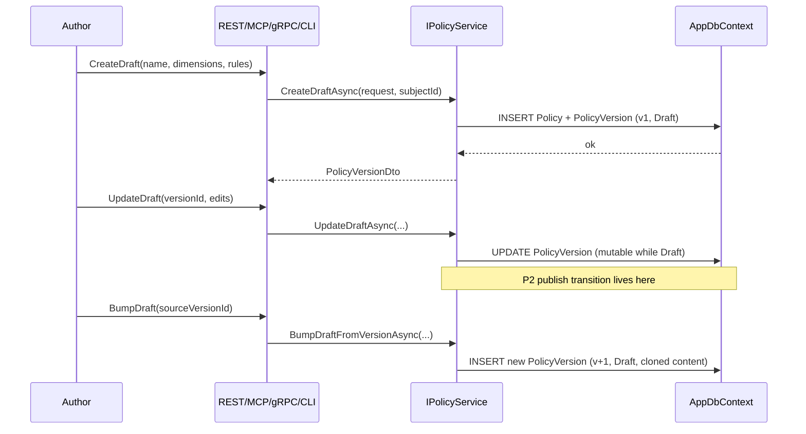

# Policy Document Core

The canonical entry point for the andy-policies catalog model.

This document describes the core domain shape (Policy + PolicyVersion), the three orthogonal dimensions every policy carries, the opaque rules DSL, the version-monotonicity invariants, and how the four parity surfaces (REST, MCP, gRPC, CLI) expose the same operations. It targets two audiences: a new contributor joining the andy-policies team, and a consumer-service engineer who needs to integrate against the catalog.

For the why behind the aggregate split (stable identity + immutable history), see [ADR 0001 — Policy versioning](../adr/0001-policy-versioning.md). For lifecycle states, see [ADR 0002](../adr/0002-lifecycle-states.md). For audit, [ADR 0006](../adr/0006-audit-hash-chain.md). For the edit RBAC matrix, [ADR 0007](../adr/0007-edit-rbac.md).

> **Scope reminder.** This service defines *what* policies are. It does not evaluate whether a run violates a policy, gate actions, or write decision logs — those belong to consumers (Conductor's ActionBus, andy-tasks per-task gates). Every example below demonstrates authoring, versioning, or lifecycle, not enforcement.

## Aggregate

The catalog is two related entities, intentionally split:



`Policy` carries stable identity (the slug name, creation metadata) and is mutable in place — renaming or editing the description does not invalidate consumer references. `PolicyVersion` carries all content (dimensions, scopes, rules, summary) and lifecycle state, and is **append-only after publish**: once `State != Draft`, every content property is frozen. The immutability boundary is enforced both in the aggregate (`PolicyVersion.MutateDraftField` guard) and at persistence time (a `SaveChangesAsync` override in `AppDbContext` rejects modifications to non-Draft rows). See `tests/Andy.Policies.Tests.Unit/Persistence/AppDbContextImmutabilityGuardTests.cs` for the exact behaviour.

Consumer references always target `PolicyVersion.Id` (a Guid), never `(PolicyId, Version)` — the integer is a human label, not a cross-service identifier.

## Dimensions

Every `PolicyVersion` carries three independent axes. They are stored on the version (so they can change between v1 and v2) but cannot be edited within a published version.

### Enforcement (RFC 2119 posture)

| Value | Storage | Wire format | Consumer interpretation |
|-------|---------|-------------|-------------------------|
| `MUST` | `EnforcementLevel.Must` | `"MUST"` | Hard deny on non-compliance. Conductor admission blocks the action. |
| `SHOULD` | `EnforcementLevel.Should` | `"SHOULD"` | Warn + proceed. Override requires a rationale (P5). |
| `MAY` | `EnforcementLevel.May` | `"MAY"` | Informational; no gate. |

Wire format is uppercase to preserve the RFC 2119 convention so consumers can grep policy bundles for the literal `MUST` / `SHOULD` / `MAY` tokens.

### Severity (triage tier)

| Value | Storage | Wire format | Consumer interpretation |
|-------|---------|-------------|-------------------------|
| `Info` | `Severity.Info` | `"info"` | No alert; surfaced in dashboards only. |
| `Moderate` | `Severity.Moderate` | `"moderate"` | Logged for review; counts against quotas. |
| `Critical` | `Severity.Critical` | `"critical"` | May trigger paging via consumer-side policy. |

Lowercase per ADR 0001 §6, matching the criticality mapping carried over from the superseded [andy-rbac#18](https://github.com/rivoli-ai/andy-rbac/issues/18) reconciliation.

### Scope (applicability tags)

A flat list of tag strings (`["repo"]`, `["prod", "tool"]`, `[]`). The hierarchical scope resolution (org → tenant → team → repo → template → run, with stricter-tightens-only) is Epic P4; P1 stores a flat list so consumers always see a non-null `scopes` field.

Service-layer canonicalisation (P1.4 `PolicyScope.Canonicalise`):

- Reject the wildcard `*` literally — it has no defined semantics here and would short-circuit hierarchical resolution later.
- Reject scopes longer than 63 characters or that don't match `^[a-z][a-z0-9:._-]{0,62}$`.
- Deduplicate and sort, so `["repo", "prod", "repo"]` and `["prod", "repo"]` persist as the same byte string. This makes `RulesJson` byte-stable (relevant for [ADR 0006](../adr/0006-audit-hash-chain.md)'s hash chain).

## Rules DSL

`PolicyVersion.RulesJson` is an **opaque jsonb blob** as far as andy-policies is concerned. The schema is defined and interpreted by consumers — Conductor's ActionBus evaluator, andy-tasks' per-task gates. This service never parses, validates against a schema, or evaluates it. P1.4's service layer enforces only that the value is syntactically valid JSON and within a size cap.

The DSL itself is preserved verbatim from the superseded [andy-rbac#17](https://github.com/rivoli-ai/andy-rbac/issues/17) (Epic V1) — that issue is the place to look for the rules-language design.

A worked example of a `no-prod` policy might encode "deny any action where the target environment matches `prod-*`":

```json
{
  "deny": [
    {
      "match": { "environment": "prod-*" },
      "reason": "production write blocked by no-prod"
    }
  ]
}
```

The exact shape is up to the consumer. From andy-policies' point of view this is a string column with a maximum length; the byte-for-byte representation is preserved (RFC 8785 JCS canonicalisation lands in P1.4 for hash-chain stability).

## Lifecycle (overview)

Every version starts in `LifecycleState.Draft` — the only mutable state. Operators promote drafts to `Active` via Epic P2's transition service. P1 ships all four enum values (`Draft`, `Active`, `WindingDown`, `Retired`) so the schema doesn't need a migration when P2 lands. See [ADR 0002](../adr/0002-lifecycle-states.md) for the full state machine.



P1's resolution rule is "highest non-Draft version is active." P2 tightens to "exactly one row with `State == Active` per policy" via the partial unique index `ix_policy_versions_one_active_per_policy`.

## Versioning invariants

The four invariants pinned in [ADR 0001](../adr/0001-policy-versioning.md) and tested by `tests/Andy.Policies.Tests.Unit`:

1. **Stable policy identity.** `Policy.Id` and `Policy.Name` (slug, unique, regex `^[a-z0-9][a-z0-9-]{0,62}$`) survive any number of version bumps. Consumer references resolve deterministically across edits.
2. **Append-only versions.** Once `State != Draft`, `PolicyVersion` content fields are frozen. Allow-listed transition fields (`State`, `PublishedAt`, `PublishedBySubjectId`, `SupersededByVersionId`, `Revision`) are the only properties that may move post-publish; everything else throws on `SaveChangesAsync`.
3. **Monotonic versions per policy.** `(PolicyId, Version)` is a unique composite index; `Version` starts at 1 and increments by 1 per `BumpDraftFromVersionAsync`. Gaps from deleted drafts are still filled (max-based numbering).
4. **At most one open Draft per policy.** Enforced by the partial unique index `ix_policy_versions_one_draft_per_policy`. Authors must publish the current draft (or delete it) before bumping a new one.

## Authoring flow

The happy path from blank slate to a published v1, with the surfaces that drive each step:



P1.5 gives `POST /api/policies` and `PUT /api/policies/{id}/versions/{vId}` as REST entry points; the MCP read tools (P1.6) and gRPC service (P1.7) are read-only in P1; the CLI (P1.8) wraps the REST surface.

## Four-surface access table

The same `IPolicyService` instance backs every surface. Surface-specific serialisers must not drift — P1.11's `tests/Andy.Policies.Tests.Integration/Parity/CrossSurfaceParityTests.cs` pins this with one assertion per scenario.

| Operation | REST | MCP | gRPC | CLI |
|---|---|---|---|---|
| Get policy by id | `GET /api/policies/{id}` | `policy.get(policyId)` | `PolicyService.GetPolicy({id})` | `andy-policies-cli policies get <id-or-name>` |
| Get policy by slug | `GET /api/policies/by-name/{name}` | (use `policy.get` with id) | `PolicyService.GetPolicyByName({name})` | `andy-policies-cli policies get <slug>` |
| List policies | `GET /api/policies?...` | `policy.list(...)` | `PolicyService.ListPolicies({...})` | `andy-policies-cli policies list --filter ...` |
| List versions | `GET /api/policies/{id}/versions` | `policy.version.list(policyId)` | `PolicyService.ListVersions({policyId})` | `andy-policies-cli versions list <policy>` |
| Active version | `GET /api/policies/{id}/versions/active` | `policy.version.get-active(policyId)` | `PolicyService.GetActiveVersion({policyId})` | `andy-policies-cli policies active <policy>` |
| Create draft | `POST /api/policies` | (read-only) | (read-only) | `andy-policies-cli versions draft-new ...` |
| Update draft | `PUT /api/policies/{id}/versions/{vId}` | (read-only) | (read-only) | `andy-policies-cli versions draft-edit ...` |
| Bump draft | `POST /api/policies/{id}/versions/{vId}/bump` | (read-only) | (read-only) | `andy-policies-cli versions draft-bump ...` |

MCP tools and gRPC RPCs in P1 are read-only by design — mutations go through REST or the CLI (which itself dispatches to REST). MCP write tools land with later epics' authoring stories.

The OpenAPI document at `docs/openapi/andy-policies-v1.yaml` is the canonical wire-format spec for REST. CI's `openapi-drift` job (P1.9) regenerates it on every push and fails on any diff against the committed file.

## Stock policies

The catalog ships six canonical policies seeded at boot in `state = Draft` (P1.3). Consumers can reference them by slug from day one; operators promote to `Active` via Epic P2.

| Slug | Enforcement | Severity | Scopes | Summary |
|---|---|---|---|---|
| `read-only` | MUST | Info | `[]` | Read/list operations only; no writes, no side effects. |
| `write-branch` | SHOULD | Moderate | `[repo]` | Writes are permitted only on non-default branches. |
| `sandboxed` | MUST | Moderate | `[tool, container]` | Execution must occur inside an isolated container/sandbox. |
| `draft-only` | MUST | Info | `[template]` | Output is advisory/draft; no publish/merge/deploy. |
| `no-prod` | MUST | Critical | `[prod]` | No actions against production resources. |
| `high-risk` | MUST | Critical | `[]` | Requires explicit approver sign-off (Epic P5 override). |

The seeder (`PolicySeeder.SeedStockPoliciesAsync`) is idempotent by-presence — it short-circuits if any policy already exists, so operator edits survive restarts. A re-seed escape hatch arrives with Epic P8's bundle import.

## Where to go next

- **Code entry points**: `src/Andy.Policies.Domain/Entities/Policy.cs`, `src/Andy.Policies.Domain/Entities/PolicyVersion.cs`, `src/Andy.Policies.Application/Interfaces/IPolicyService.cs`, `src/Andy.Policies.Infrastructure/Services/PolicyService.cs`.
- **Wire contract**: `docs/openapi/andy-policies-v1.yaml`.
- **Tests as executable spec**: `tests/Andy.Policies.Tests.Unit/Domain/`, `tests/Andy.Policies.Tests.Unit/Services/`, `tests/Andy.Policies.Tests.Integration/Parity/`.
- **Decision rationale**: [ADR 0001](../adr/0001-policy-versioning.md), [0002](../adr/0002-lifecycle-states.md), [0006](../adr/0006-audit-hash-chain.md), [0007](../adr/0007-edit-rbac.md).
