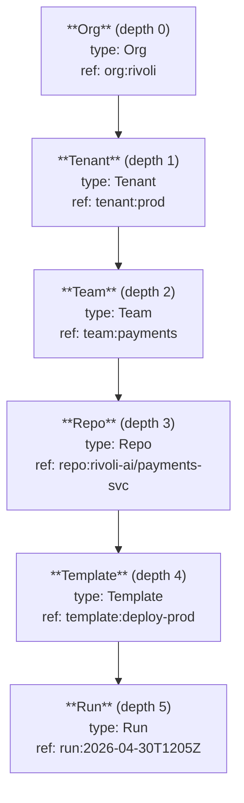
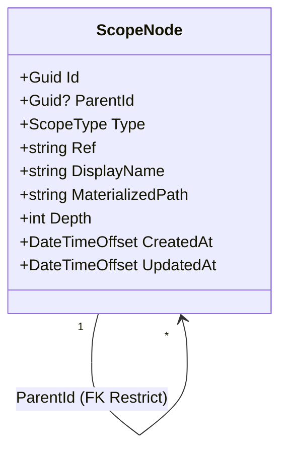

# Scope Hierarchy

How andy-policies stores the `Org → Tenant → Team → Repo → Template → Run`
graph and how every read path joins on it. Targeted at a contributor
about to touch `ScopeService`, `BindingResolutionService`, or
`TightenOnlyValidator`, and a consumer engineer wiring up a new scope-
aware integration. For the *why* — typed levels, materialized path,
cycle-impossibility — see [ADR 0004 — Scope hierarchy](../adr/0004-scope-hierarchy.md).
For the resolution algorithm with worked examples, see
[Resolution Algorithm](resolution-algorithm.md).

> **Scope reminder.** This document specifies the hierarchy *storage
> shape and read paths*. It does not specify enforcement — that's a
> consumer concern (Conductor's ActionBus, andy-tasks per-task gates).

## Hierarchy diagram

Six levels, fixed order. The `ScopeType` enum's ordinal doubles as the
canonical depth — `ScopeType.Org = 0` lives at depth 0, `ScopeType.Run = 5`
lives at depth 5. The service-layer invariant `(int)Type == Depth` is
enforced on every create.

## Type ladder + ladder enforcement

| Type      | Ordinal/Depth | Required parent type |
|-----------|--------------:|----------------------|
| Org       | 0             | (root — null parent) |
| Tenant    | 1             | Org                  |
| Team      | 2             | Tenant               |
| Repo      | 3             | Team                 |
| Template  | 4             | Repo                 |
| Run       | 5             | Template             |

`ScopeService.CreateAsync` rejects a child whose `Type` doesn't match
`parent.Type + 1`, and rejects a non-Org root, with
`InvalidScopeTypeException` (HTTP 400, `errorCode = "scope.parent-type-mismatch"`).

## Aggregate

`ScopeNode.MaterializedPath` is a slash-separated chain of ancestor ids
ending in self: `/{rootId}/.../{selfId}`. It's set on insert and never
mutated. `Depth` is denormalised from the path for constant-time level
checks.

## Storage indexes

| Index                                | Columns                  | Used by                                 |
|--------------------------------------|--------------------------|-----------------------------------------|
| `ix_scope_nodes_type_ref` (unique)   | `(Type, Ref)`            | uniqueness invariant; lookup by `(Type, Ref)` |
| `ix_scope_nodes_parent_id`           | `(ParentId)`             | `GetTreeAsync` + child counts on delete |
| `ix_scope_nodes_materialized_path`   | `(MaterializedPath)`     | `GetDescendantsAsync` via LIKE prefix scan |

The unique `(Type, Ref)` index permits the same `Ref` under different
types (a `Team` and a `Repo` can share a slug if scopes happen to
collide); only the `(Type, Ref)` pair must be unique. Cross-provider:
the same SQL CREATE INDEX shape works on Postgres + SQLite.

## Walk paths

### Walk-up (ancestors)

`IScopeService.GetAncestorsAsync(id)`:

1. Load the target node (raises `NotFoundException` if missing).
2. Parse the materialized path; strip the trailing self-id.
3. Single-shot `WHERE Id IN (...)` to load the ancestor rows.
4. Sort by `Depth` ascending — root first.

The path parsing is what makes the walk SQLite-safe: no recursive CTE,
no provider-specific syntax. p99 < 50 ms on a 6-level chain (P4.7
`ScopeWalkPerfTests`).

### Walk-down (descendants)

`IScopeService.GetDescendantsAsync(id)`:

1. Load the target node.
2. Single-shot `WHERE MaterializedPath LIKE '<path>/%'` (covered by
   `ix_scope_nodes_materialized_path`).
3. Client-side sort by `(Depth, Ref)` — provider-stable.

The trailing slash on the prefix excludes the node itself and avoids
false-positive matches across nodes whose ids share a prefix
(e.g. `/abc-123` vs `/abc-1234`).

### Tree (full forest)

`IScopeService.GetTreeAsync()` materialises every node in one round-
trip and assembles the forest in memory by grouping on `ParentId`.
Ordering at each level: `Ref` ASC. Returns one `ScopeTreeDto` per root
(typically one — the seeded root Org).

## Mutation rules

### Create

`POST /api/scopes` and equivalents:

1. Validate `Ref` non-empty (after trim) and ≤ 512 chars; `DisplayName`
   non-empty and ≤ 256 chars.
2. Resolve `ParentId` if non-null (raises `NotFoundException` if missing).
3. Enforce the type ladder (raises `InvalidScopeTypeException` on
   mismatch).
4. Build the materialized path from the parent's path; stamp `Depth`
   from `(int)Type`.
5. Insert. The unique `(Type, Ref)` index catches concurrent racers
   and translates to `ScopeRefConflictException` (HTTP 409).

### Update

`PUT /api/scopes/{id}` updates only `DisplayName`. `ParentId` and
`Type` are immutable post-insert by design — re-parenting is out of
scope for Epic P4 (cycle-impossibility relies on this).

### Delete

`DELETE /api/scopes/{id}`:

1. Load the target.
2. Count children (`WHERE ParentId = @id`); if non-zero, refuse with
   `ScopeHasDescendantsException` (HTTP 409, `errorCode =
   "scope.has-descendants"`, `childCount` in extensions).
3. Hard-delete the row. Audit cross-cuts via Epic P6.

Soft-delete is deliberately out of scope at the entity level. Audit
preserves the deletion record; scope nodes don't need tombstone rows
because their primary use case (ancestor lookup) doesn't benefit from
historical retention.

## Surface parity

| Surface | Operation                                                               | Story |
|---------|-------------------------------------------------------------------------|-------|
| REST    | `GET/POST/DELETE /api/scopes…` (six endpoints)                          | [P4.5](https://github.com/rivoli-ai/andy-policies/issues/33) |
| MCP     | `policy.scope.{list,get,tree,create,delete,effective}`                  | [P4.6](https://github.com/rivoli-ai/andy-policies/issues/34) |
| gRPC    | `andy_policies.ScopesService` — six RPCs                                | [P4.6](https://github.com/rivoli-ai/andy-policies/issues/34) |
| CLI     | `andy-policies-cli scopes {list,get,tree,create,delete,effective}`      | [P4.6](https://github.com/rivoli-ai/andy-policies/issues/34) |

All four surfaces delegate to the same `IScopeService` and
`IBindingResolutionService` — there is no business logic anywhere
outside. The cross-surface parity is verified by the per-surface
test suites (`ScopesControllerTests`, `ScopeToolsTests`,
`ScopesGrpcServiceTests`, `CliScopesEndToEndTests`) running the same
logical request through each.

## Error mapping

| Service exception                       | REST    | gRPC                  | MCP error code                           |
|-----------------------------------------|---------|-----------------------|------------------------------------------|
| `NotFoundException`                     | 404     | `NotFound`            | `policy.scope.not_found`                 |
| `InvalidScopeTypeException`             | 400     | `FailedPrecondition`  | `policy.scope.parent_type_mismatch`      |
| `ScopeRefConflictException`             | 409     | `AlreadyExists`       | `policy.scope.ref_conflict`              |
| `ScopeHasDescendantsException`          | 409     | `FailedPrecondition`  | `policy.scope.has_descendants`           |
| `ValidationException`                   | 400     | `InvalidArgument`     | `policy.scope.invalid_input`             |

CLI exit codes follow the federated-CLI contract from Conductor
Epic AN: 0 success / 1 transport / 3 auth / 4 not found / 5 conflict.

## Tighten-only — read + write

The chain hierarchy is the substrate the tighten-only rule walks over.
For the rule itself — Mandatory binds propagate downward, Recommended
binds may upgrade, Mandatory cannot be downgraded — see
[Resolution Algorithm](resolution-algorithm.md) and
[ADR 0004 §4](../adr/0004-scope-hierarchy.md#4-tighten-only-is-enforced-at-both-read-and-write).

In short:

- **Read time** (`IBindingResolutionService.ResolveForScopeAsync`):
  silently drops downstream `Recommended`s shadowed by ancestor
  `Mandatory`. Consumers see the cleaner answer.
- **Write time** (`ITightenOnlyValidator.ValidateCreateAsync`):
  refuses to commit a `Recommended` binding whose `PolicyId` is
  bound `Mandatory` upstream. The catalog stays clean.
- **Delete is not a tighten-only vector** — a delete cannot produce
  a weaker downstream binding (P4.4 §reviewer-flagged
  reconciliation).

## Concurrency

Creates against the same `(Type, Ref)` race the unique index — one
commits, the others surface `ScopeRefConflictException`. The Postgres
testcontainer suite `ScopeServiceConcurrencyTests` (P4.2) demonstrates
N=10 parallel creators on the same target with exactly one survivor.

Re-parenting is impossible by design (`ParentId` is immutable post-
insert), so cycle prevention has no runtime cost. `ScopeCycleRejectionTests`
(P4.7) enforce the contract.

## Performance budget

| Path                                     | p99 target | Test                                  |
|------------------------------------------|-----------:|---------------------------------------|
| `GetAncestorsAsync` (6-level chain)      |     50 ms  | `ScopeWalkPerfTests` (P4.7, Postgres) |
| `ResolveForScopeAsync` (6-level + 200 bindings) | 150 ms (50 ms target + headroom) | `ScopeWalkPerfTests` (P4.7, Postgres) |

Both budgets pass on a Docker host. The headroom on `ResolveForScopeAsync`
absorbs CI runner noise; the production target is 50 ms p99.

## Cross-references

- [ADR 0001 — Policy versioning](../adr/0001-policy-versioning.md) —
  the aggregate the bindings + resolver join against.
- [ADR 0002 — Lifecycle states](../adr/0002-lifecycle-states.md) —
  the Retired state the chain resolver surfaces transparently
  (deliberate divergence from P3.4 exact-match).
- [ADR 0003 — Bindings](../adr/0003-bindings.md) — the binding rows
  the chain walker gathers.
- [ADR 0004 — Scope hierarchy](../adr/0004-scope-hierarchy.md) — this
  document's authoritative companion.
- [Resolution Algorithm](resolution-algorithm.md) — the step-by-step
  fold with worked examples.
- [Bindings (design)](bindings.md) — the binding model + soft-delete
  semantics.
- [Lifecycle States (design)](lifecycle.md) — the state machine the
  resolver doesn't filter on.
